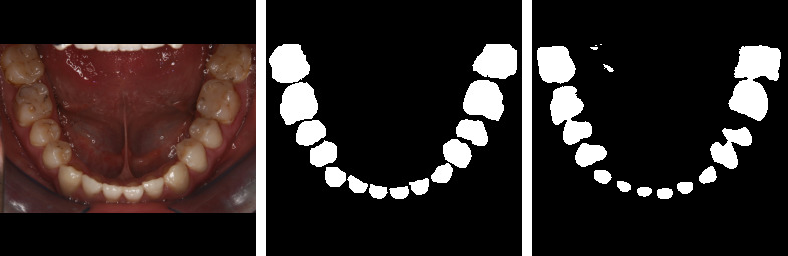

# Polyp-Segmentation-using-UNET-in-TensorFlow-2.0

Implementing polyp segmentation using the U-Net.  
 
 

## Results
The images given below are in the sequence: (1) Input Image, (2) Ground Truth, (3) Predicted Mask   

